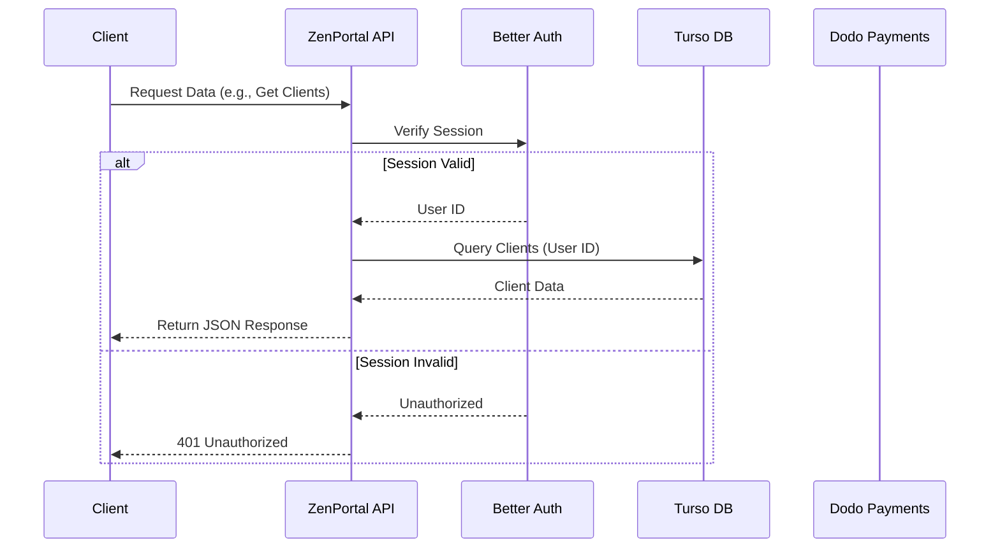

# ZenPortal API

The backend API for ZenPortal, built with Hono, Drizzle ORM, and Turso (SQLite).

## Business Overview
The ZenPortal API serves as the central nervous system for the platform, orchestrating data flow between the public website, the client dashboard, and external services.
-   **Central Data Hub**: Manages all core entities including Users, Clients, Logs, and Billing information.
-   **Security & Compliance**: Handles authentication, ensuring data privacy and secure access control.
-   **Payment Processing**: Integrates with Dodo Payments to manage subscriptions and billing cycles.

## Technical Overview
Built on **Hono**, a small, fast, and ultrafast web framework for the Edges, the API leverages **Turso** (libSQL) for a distributed database solution.
-   **Architecture**: Serverless-ready HTTP API designed for low latency.
-   **Database**: **Drizzle ORM** provides a type-safe bridge to the **Turso** database, ensuring data integrity.
-   **Authentication**: **Better Auth** manages session handling and user verification.

## Architecture Visuals



## Tech Stack
-   **Framework:** [Hono](https://hono.dev/)
-   **Database:** [Turso](https://turso.tech/) (SQLite)
-   **ORM:** [Drizzle ORM](https://orm.drizzle.team/)
-   **Auth:** [Better Auth](https://www.better-auth.com/)
-   **Payments:** [Dodo Payments](https://dodopayments.com/)

## Getting Started

### Prerequisites
-   [Bun](https://bun.sh/) (Runtime & Package Manager)

### Installation

Install dependencies:
```sh
bun install
```

### Running the Server

Start the Hono development server:
```sh
bun run dev
```
The server will be available at `http://localhost:3000`.

## Database Setup

Push schema changes to the live Turso database:
```sh
# This reads src/db/schema.ts and creates tables in Turso
bun run dk:push
```
*Note: Ensure your `.env` variables are correctly set for Turso connection.*

## Payments Setup (Dodo Payments)

Ensure you have your Dodo Payments credentials configured in your `.env` file.

```env
DODO_PAYMENTS_API_KEY=your_api_key
DODO_PAYMENTS_WEBHOOK_SECRET=your_webhook_secret
```