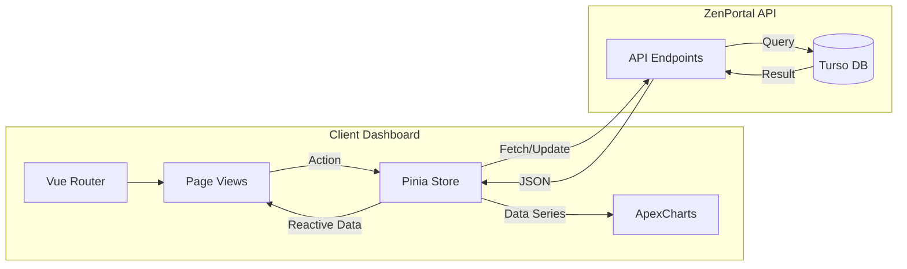

# ZenPortal Client Dashboard

The client dashboard for ZenPortal, providing analytics and management tools for clients.

## Business Overview
The Client Dashboard is the operational hub where users manage their business data within ZenPortal.
-   **Client Management**: Users can add, edit, and track their own clients.
-   **Performance Tracking**: Visualizes logs and earnings through interactive charts.
-   **Self-Service**: Allows users to manage their profile, billing settings, and preferences.

## Technical Overview
A robust **Vue 3** application designed for interactivity and data visualization.
-   **State Management**: **Pinia** handles global state (User session, Clients list, Logs), ensuring data consistency across components.
-   **Data Visualization**: **ApexCharts** is used to render complex data (earnings, logs) into understandable graphs.
-   **API Integration**: Consumes the **ZenPortal API** for all CRUD operations, ensuring real-time data synchronization.

## Application Logic Visuals



## Tech Stack
-   **Framework:** [Vue 3](https://vuejs.org/)
-   **Build Tool:** [Vite](https://vitejs.dev/)
-   **State Management:** [Pinia](https://pinia.vuejs.org/)
-   **Charting:** [ApexCharts](https://apexcharts.com/) / [Vue3-ApexCharts](https://github.com/apexfull/vue3-apexcharts)
-   **Styling:** [Tailwind CSS](https://tailwindcss.com/)
-   **Language:** [TypeScript](https://www.typescriptlang.org/)

## Getting Started

### Prerequisites
-   [Bun](https://bun.sh/) or Node.js

### Installation

Install dependencies:
```sh
bun install
```

### Development

Start the development server:
```sh
bun run dev
```
The application will be available at `http://localhost:5173` (or the port shown in your terminal).

### Build

Build the application for production:
```sh
bun run build
```

### Preview

Preview the production build:
```sh
bun run preview
```
