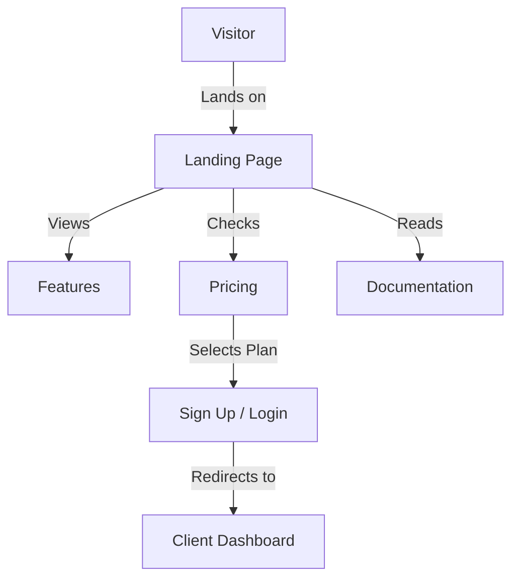

# ZenPortal Web

The main web interface for ZenPortal, built with Vue 3 and Vite.

## Business Overview
ZenPortal Web is the public-facing gateway to the platform. It is designed to convert visitors into users by showcasing features, pricing, and documentation.
-   **Marketing & Conversion**: Landing pages optimized to explain the value proposition and drive sign-ups.
-   **Information Hub**: Hosts documentation, terms of service, and privacy policies.
-   **User Onboarding**: Provides the initial touchpoint for account creation and login.

## Technical Overview
This project is a **Single Page Application (SPA)** built with **Vue 3** and **Vite**, offering a fast and reactive user experience.
-   **Styling**: Utilizes **Tailwind CSS** for a modern, responsive, and utility-first design system.
-   **Routing**: **Vue Router** manages client-side navigation, ensuring smooth transitions between pages without full reloads.
-   **Type Safety**: Written in **TypeScript** to ensure code reliability and maintainability.

## User Flow Visuals



## Tech Stack
-   **Framework:** [Vue 3](https://vuejs.org/)
-   **Build Tool:** [Vite](https://vitejs.dev/)
-   **Styling:** [Tailwind CSS](https://tailwindcss.com/)
-   **Language:** [TypeScript](https://www.typescriptlang.org/)

## Getting Started

### Prerequisites
-   [Bun](https://bun.sh/) or Node.js

### Installation

Install dependencies:
```sh
bun install
```

### Development

Start the development server:
```sh
bun run dev
```
The application will be available at `http://localhost:5173` (or the port shown in your terminal).

### Build

Build the application for production:
```sh
bun run build
```

### Preview

Preview the production build:
```sh
bun run preview
```
